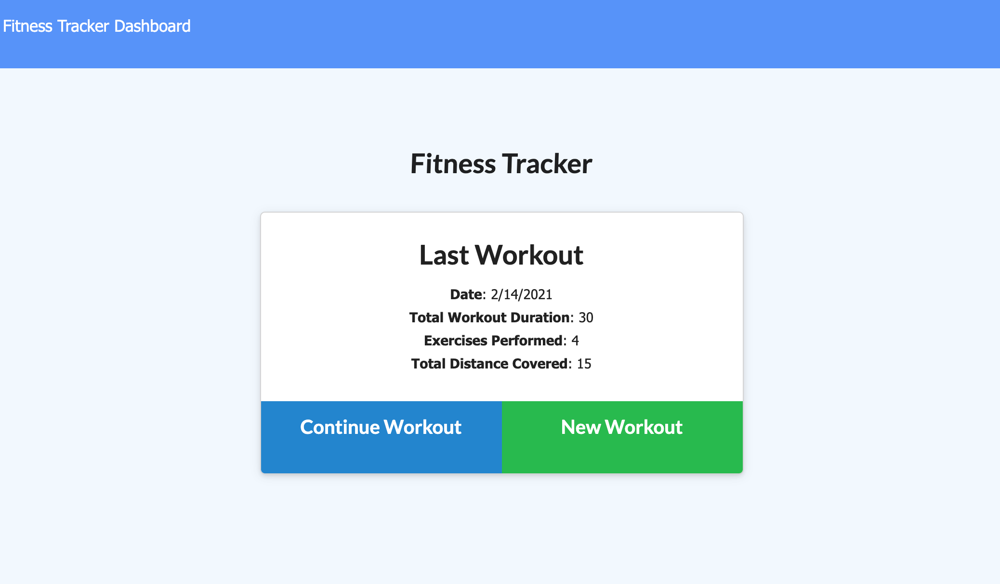

# Fitness Tracker

## Objective
To create workout tracker by using the provided front end code. This assignment will require you to create Mongo database with a Mongoose schema and handle routes with Express.

## Acceptance Criteria
- When the user loads the page, they should be given the option to create a new workout or continue with their last workout.
- The user should be able to:

  * Add exercises to the most recent workout plan.

  * Add new exercises to a new workout plan.

  * View the combined weight of multiple exercises from the past seven workouts on the `stats` page.

  * View the total duration of each workout from the past seven workouts on the `stats` page.
- Deploy the application with a MongoDB database to Heroku.

## Application

### Github Repository URL
https://github.com/thammaraku/Fitness_Tracker

### Heroku Deployed Link
https://dashboard.heroku.com/apps/shrouded-oasis-09842

### Application Screenshot

## Knowledge learned from this assignment
1. Using MongoDB database
2. Deploy MondoDB database to Heroku
3. Using Mongoose library with MongoDB